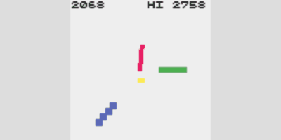
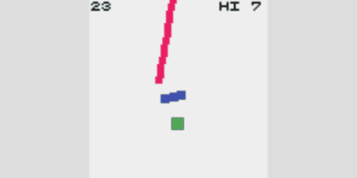
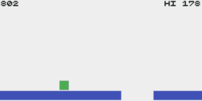
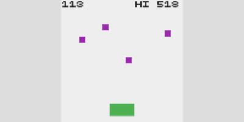
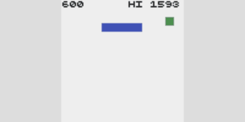
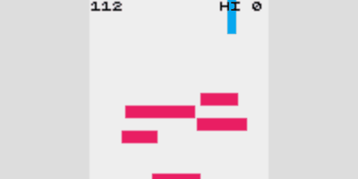
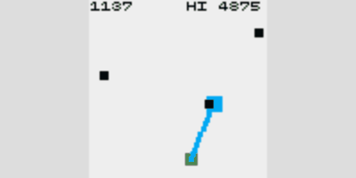
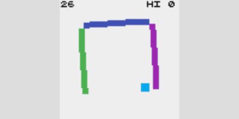

# kackac

Kac-kac (rect-rect) games.

## Demo

[3arms](https://abagames.github.io/kackac/?3arms)

[](https://abagames.github.io/kackac/?3arms)

```
tc||(a=range(3).map(_=>[-PI/2,0,rnds(.01)]),x=50),a.map((b,i)=>{col=[R,G,B][i],bar(50,50,16,3+i,b[0],-i),b[0]+=b[1]+=b[2]/(4-i),b[1]*=.95,rnd()<.01&&(b[2]=rnds(.01)*df)}),col=Y;p=clamp(inp.p.x,0,99);line(p,58,x,58)&&(play(E),end()),scr+=abs(p-x),x+=(p-x)/7
```

[rotwal](https://abagames.github.io/kackac/?rotwal)

[](https://abagames.github.io/kackac/?rotwal)

```
tc||(r=vec(0,99)),r.y>98&&(r=vec(rnd(9,90)),l=0,a=rnd(2*PI),m=rnds(.1)*df),col=G,box(p=vec(50,70),7,7),p.addAngle(b=p.getAngle(inp.p),15),col=B,bar(p,9,5,b+PI/2),col=R;c=bar(r,l,4,a,0);c&B&&(play(C),r.y=99,scr++),c&G&&(play(U),end()),l+=df,r.y+=df,a+=m
```

[golfme](https://abagames.github.io/kackac/?golfme)

[](https://abagames.github.io/kackac/?golfme)

```
tc||(p=vec(50,85),j=a=h=i=0),h+i<=0&&(h=199,i=rnd(50,150)),col=B,rect(0,90,h,9),rect(h+i,90,200,9),col=G;c=box(p,9,9);(p.x<0||p.y>99)&&(play(U),end()),j?(p.add(v),v.y+=.1,c&B&&(j=a=0,p.y=85)):(inp.ip&&(a-=.05,bar(p,20,3,a,0)),inp.ijr&&(play(J),j=1,v=vec(4).rotate(a)));s=.1*clamp(p.x-50,0,99)+df;p.x-=s,h-=s,scr+=s
```

[balbou](https://abagames.github.io/kackac/?balbou)

[](https://abagames.github.io/kackac/?balbou)

```
tc||(b=[]),tc%222==0&&b.push({p:vec(50,10),v:vec(rnds(.5),0)}),col=G,box(x=inp.p.x,90,20,10),col=P,b=b.filter(c=>{p=c.p,v=c.v;return p.add(v),v.y+=.02*df,v.mul(.99),box(p,5,5)&G&&(v.y=-2*sqrt(df),v.x+=.05*(p.x-x),scr+=pow(b.length,2),play(C)),p.y>99&&(play(U),end()),p.x>0&&p.x<99})
```

[jujmp](https://abagames.github.io/kackac/?jujmp)

[](https://abagames.github.io/kackac/?jujmp)

```
tc||(p=vec(50,50),v=vec(),w=[vec(50,70)],j=m=d=1),p.add(v),v.y+=inp.ip?.05:.1;s=(p.y<30?.1*(30-p.y):0)+.1*df;for(scr+=s,(d-=s)<0&&(d=rnd(99),w.push(vec(rnd(99),-9))),p.y+=s,col=B,w=w.filter(l=>(l.y+=s,box(l,33,7),l.y<99)),col=T;box(p,7,7);)p.y--,v.set(),m=1;col=G,box(p,7,7),inp.ijp&&(play(J),v.x=j*=-1,v.y=-3*m,m*=.7),p.y>99&&(play(E),end())
```

[baarr](https://abagames.github.io/kackac/?baarr)

[](https://abagames.github.io/kackac/?baarr)

```
tc||(b=[],d=y=p=j=0),0===j&&inp.ip&&(play(H),j=c=1),col=C,j>0?(j<10&&(col=B),j++>30&&(j=0)):p+=.1,box(50+30*sin(p),(j<1?0:j<10?10*j:5*(30-j))-40,5,99),s=(y>50?.1*(y-50):0)+.1*df+.03*j,y=99,col=R,b=b.filter(a=>{if(a.p.x=a.c+sin(a.a+=a.v)*a.r,a.p.y-=s,a.p.y<y&&(y=a.p.y),a.p.y<0&&(play(U),end()),!(box(a.p,a.w,7)&B))return!0;play(L),scr+=c++}),(d-=s)<0&&(z=105,range(rndi(1,5)).map(i=>{b.push({p:vec(0,z),c:rnd(30,70),a:rnd(2*PI),v:rnd(.01,.1),r:rnd(9,30),w:rnd(20,40)}),z+=7,d+=10}),d+=rnd(99))
```

[zartan](https://abagames.github.io/kackac/?zartan)

[](https://abagames.github.io/kackac/?zartan)

```
tc||(n=[],p=vec(99,d=9),v=vec(),a=z=null),s=(p.x>30?.1*(p.x-30):0)+.1*df,scr+=s,p.x-=s,v.y+=.02,v.y<0&&p.y<0&&(v.y*=-1),p.y>99&&(play(U),end()),v.mul(.99),p.add(v),col=G,box(p,7,7),o=99,n.map(m=>{q=abs(m.y-p.y),m.x>p.x&&q<o&&(o=q,z=m)}),col=C,z&&(box(z,9,9),inp.ijp&&(play(S),a=z)),inp.ip&&a&&(b=vec(a).sub(p).div(199),v.add(b),line(p,a),a.x<0&&(a=null)),inp.ijr&&(a=null),(d-=s)<0&&(d+=rnd(9,66),n.push(vec(99,rnd(66)))),col=L,n=n.filter(m=>(m.x-=s,box(m,5,5),m.x>0))
```

[enqbox](https://abagames.github.io/kackac/?enqbox)

[](https://abagames.github.io/kackac/?enqbox)

```
tc||(r=d=h=0,b=vec(50,50),v=vec()),s=.05*df,r+=inp.ip?s:-s,[R,G,B,P].map((c,i)=>{if(h!=i&&(a=r+i*PI/2,p=vec(50,50).addAngle(a,30),col=c,a+=PI/2,bar(p,50,5,a),d&c)){for(f=vec(v).rotate(-a),f.x=0,f.y=clamp(-2.7*f.y,1,4),f.rotate(a),v.add(f),f.normalize(),col=T;box(b,7,7)&c;b.add(f));h=i,play(C),scr++}}),b.add(v),v.y+=.02*df,v.mul(.99),col=C,d=box(b,7,7),b.isInRect(0,0,99,99)||(play(E),end())
```
