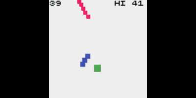

# kackac

Kac-kac (rect-rect) games.

## Demo

[rotwal](https://abagames.github.io/kackac/index.html?rotwal)

[](https://abagames.github.io/kackac/index.html?rotwal)

```
tc||(r=vec(0,99)),r.y>98&&(r=vec(rnd(10,90),0),l=0,a=rnd(2*PI),m=rnd(-.1,.1)*df),col=G;p=vec(50,70);rect(p,7,7);b=p.getAngle(inp.p);p.addAngle(b,15),col=B,bar(p,9,5,b+PI/2),col=R;c=bar(r,l,4,a,0);c&B&&(play(C),r.y=99,scr++),c&G&&(play(U),end()),l+=df,r.y+=df,a+=m
```
